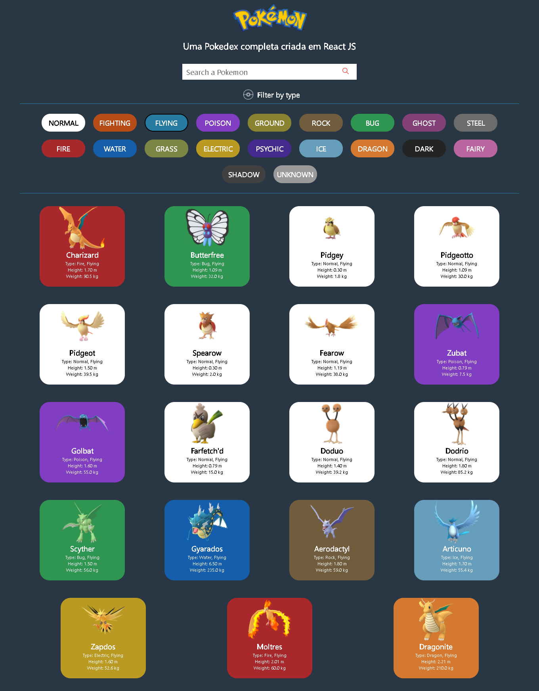

# Pokedex 1ª geração

> Pokedex surgiu com o teste de conhecimento de estágio do Valeu App. Na aplicação, é possível listar, pesquisar e filrar pokemons da primeira geração.

## 🚀 Instalando Pokedex

Para instalar o Pokedex, siga estas etapas:

1. Abra o terminal do seu computador no local em que deseja colocar o projeto.
2. Faça um clone desse repositório rodando:   `git clone https://github.com/oscarkemuel/pokedex-app.git`;
3. Entre na pasta rodando: `cd pokedex-app`;
4. Rode `yarn install` ou `npm install` para instalar as dependências do projeto;
5. Rode `yarn start` ou `npm start` para iniciar o servidor de desenvolvimento.

## :computer: Dependências

* react
* axios
* react-dom
* react-icons
* react-scripts
* styled-components
* type-script

## 📫 Contribuindo para Pokedex
Para contribuir com Pokedex, siga estas etapas:

1. Bifurque este repositório.
2. Crie um branch: `git checkout -b <nome_branch>`.
3. Faça suas alterações e confirme-as: `git commit -m '<mensagem_commit>'`
4. Envie para o branch original: `git push origin <nome_do_projeto> / <local>`
5. Crie a solicitação de pull.
